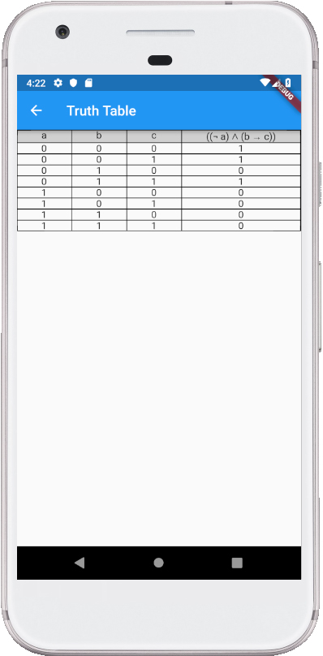

# truth_table

An application that generates a truth table with all the possible outcomes for a given expression.
This project was originally for a contest where all the code should be less than 5 KB, but I was not able to upload it successfully.

## How to use it

If you are not familiar with boolean algebra and truth tables, just press some random operators and use the arrow keys to fill in the blank spaces with characters.
When a character or blank square is selected you can fill in any character that is not a space, any of the operators or parentheses (normaly just use characters from a to z).
When all blank spaces are filled click on the button in the top right corner of the screen to generate a truth table.

